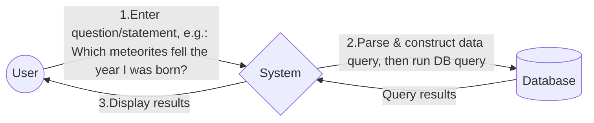

# ☄️ MeteoriteNLQ

The aim of this document is to provide a brief 1-page product specification for a proof-of-concept natural language query engine for NASA's meteorite [data set](https://data.nasa.gov/Space-Science/Meteorite-Landings/gh4g-9sfh/about_data).

## Overview
MeteoriteNLQ is a web application that allows users to query a comprehensive meteorite catalog using natural language. The motivation comes from a conversation with a five-year-old who, upon hearing about the meteorite dataset, immediately asked, “What was the biggest?” This highlights the importance of a system that can interpret plain-English queries and return data in the most intuitive format—whether it's a table, a map, or a downloadable CSV.

## Target Audience
- Curious kids, like the five-year-old who loves fun space facts
- Data scientists or astronomy enthusiasts who crave flexible data exploration and want flexibility in how they analyze the data
- Educators and hobbyists who want to easily answer “how many,” “which year,” or “where” queries without learning SQL

## Key Features
1. Natural Language Queries
   - Single text box for questions, e.g., _“Show me the 10 largest meteorites ever found.”_  
   - “Ask” button triggers the query.

2. Flexible Output Formats  
   - Table (default): a clean, paginated display (largest meteorites, years, etc.).  
   - Map with pins: if the query mentions “on a map,” display markers on a map for the relevant meteorites.  
   - CSV download: if the user requests CSV, generate a downloadable file (e.g., _“in a CSV file”_).

3. Intelligent Natural Language to Data Query Translation
   - Converts user-friendly questions/statements into underlying data queries.  
   - Summaries or partial clarifications are provided for ambiguous questions.

4. Responsive, Accessible UI
   - Minimalistic design (fewer distractions, large text options for kids).  
   - Clear “Ask” button and feedback messages (e.g., “Fetching results…”).

## User Flow
1. User inputs a question or statement, for example: “Which meteorites fell in 1985?”
2. System parses the query, constructs a data query, and executes it.
3. Results are displayed:
   - Defaults to a table of data.  
   - If “map” is mentioned, displays pins.  
   - If “CSV” is mentioned, provides a download link.

### Basic (somewhat technical) User Flow Diagram

## Success Criteria
- Immediate Engagement: A child can ask “What’s the biggest meteorite?” and see a straightforward answer.
- Versatility: Data scientists can fetch thousands of rows in their desired format, while hobbyists ask simple questions and see tables or maps.
- Simplicity: The UI remains intuitive and accessible to everyone.