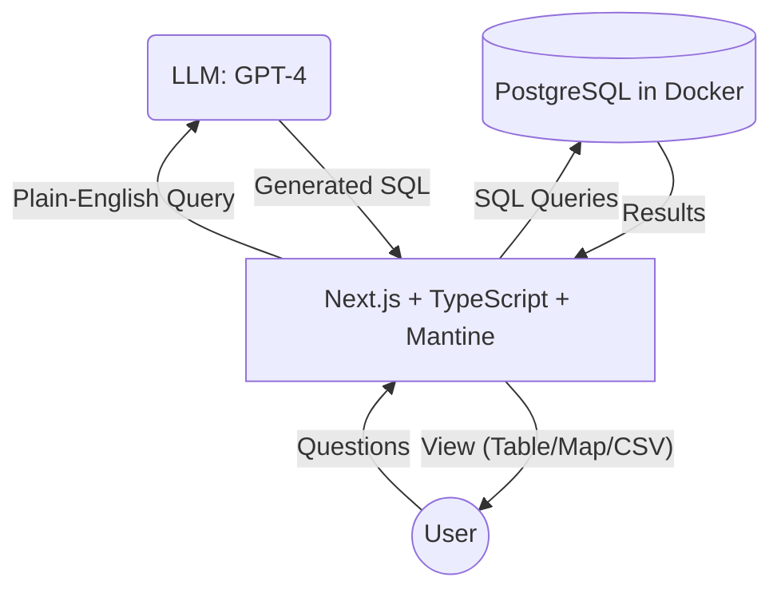

# ☄️ MeteoriteNLQ – High Level Technical Design

The aim of this document is briefly address technical design choices with rationale.

## Goals

Provide an environment using open tools allowing for rapid development and proof of concept.

## Components

### 1. Application: Fullstack Typescript with NodeJS + [Next.js](https://nextjs.org/)
  - Next.js Handles structure, building, and bundling of the application
  - Provides a great environment for rapid development of full stack web applications
  - Great community adoption and support (See [Vercel](https://vercel.com/))
  - Fontend tools: React + Mantine UI (See [Key Feature 4 in product spec](PRODUCT_SPEC.md#key-features))
    - React supported by Next.js out of the box
    - [Mantine](https://mantine.dev/) provides clean, easy to use UI components without too much effort
    - Mantine community provided a nice, [preconfigured Next.js template repository](https://github.com/mantinedev/next-pages-min-template) to hit the ground running
  - Backend tools: Next.js's page routing
    - Page routing for a basic HTTP API, suitable for this small project
    - Supports porting of data to desired output formats of user (See [Key Feature 2 in product spec](PRODUCT_SPEC.md#key-features))

### 2. Semantic Parsing with an LLM 
  - Lives in the backend, referred to as the `Semantic Parsing Layer` in code
  - Handles parsing user queries into executable SQL
  - Leverage OpenAI GPT-4o LLM with few-shot prompting method to translate English to SQL (See [Key Feature 3 in product spec](PRODUCT_SPEC.md#key-features))

### 3. Data Layer (PostgreSQL)
  - The target of the Semantic Parsing Layer's generated SQL
  - Hosted as Docker container locally
    - Using `docker compose`, the meteorite data is seeded to the database
  - PostgreSQL available as managed service in several cloud providers
  - Able to take on different data workloads if necessary
    - JSON(B) Document store: https://documentdatabase.org/blog/postgres-doc-storage/
    - Graph: https://github.com/apache/age
    - Vector: https://github.com/pgvector/pgvector

## Architecture

A rough mermaid diagram display the components and how they work together.

## ⚠️ Limitations ⚠️

1. This design relies on an LLM with limited testing of prompts. Results may be innaccurate.
2. The Semantic Parsing Layer returns raw SQL that is NOT sanitized against SQL injection attacks. If this is deployed in production, the following should be considered:
  - Use another LLM to help look for dangerous queries
  - Configure your postgres infrastructure to use readonly access to prevent bad queries from corrupting your data
  - Put strict timeouts and limitations on resource usage
  - **Strongly consider building intent-based interpreting of English queries to map back to predefined, safe queries, this is the safest approach but requires more testing.**
