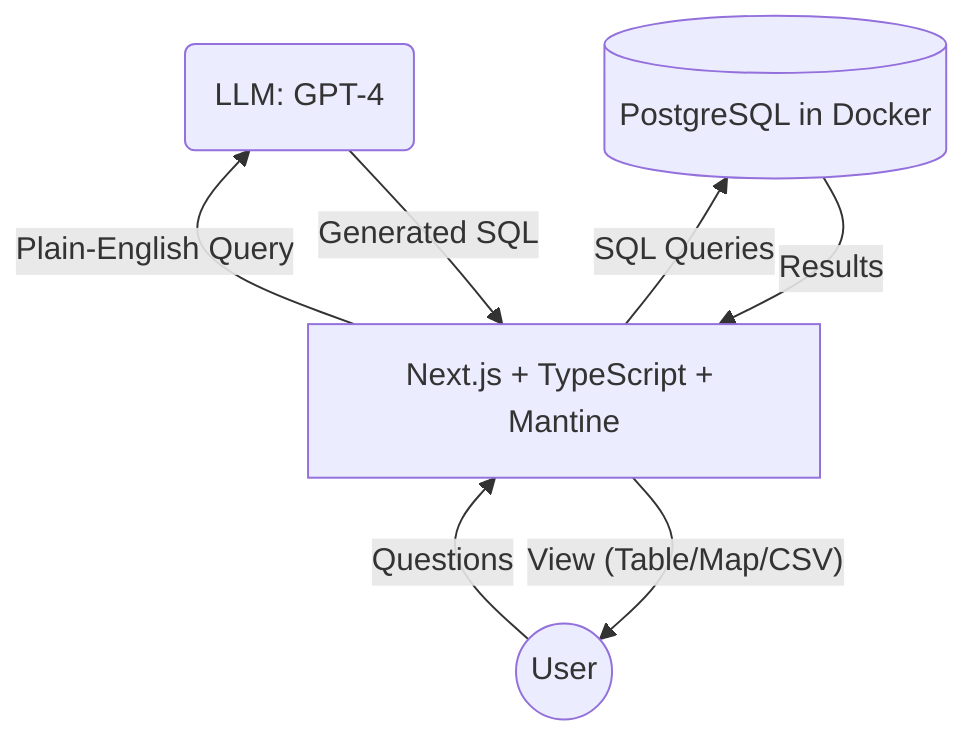

# ☄️ MeteoriteNLQ – High-Level Technical Design

The aim of this document is to briefly address technical design choices with rationale.

## Goals

Provide an environment using open tools that allow for rapid development and proof-of-concept.

## Components

### 1. Application: Fullstack TypeScript with Node.js + [Next.js](https://nextjs.org/)

- Next.js handles structure, building, and bundling of the application.
- Provides a great environment for rapid development of full-stack web applications.
- Strong community adoption and support (See [Vercel](https://vercel.com/)).
- Frontend tools: React + Mantine UI (See [Key Features 1 and 4 in the product spec](PRODUCT_SPEC.md#key-features)).
  - React is supported by Next.js out of the box.
  - [Mantine](https://mantine.dev/) provides clean, easy-to-use UI components with minimal effort.
  - The Mantine community offers a [preconfigured Next.js template repository](https://github.com/mantinedev/next-pages-min-template) for quick setup.
- Backend tools: Next.js's page routing.
  - Page routing provides a basic HTTP API, suitable for this small project.
  - Supports exporting data to the user's desired output formats (See [Key Feature 2 in the product spec](PRODUCT_SPEC.md#key-features)).

### 2. Semantic Parsing with an LLM

- Lives in the backend, referred to as the `Semantic Parsing Service` in code.
- Handles parsing user queries into executable SQL.
- Leverages OpenAI GPT-4o LLM with a few-shot prompting method to translate English to SQL (See [Key Feature 3 in the product spec](PRODUCT_SPEC.md#key-features)).

### 3. Data Layer (PostgreSQL)

- The target of the Semantic Parsing Layer's generated SQL.
- Hosted as a Docker container locally.
  - Using `docker compose`, the meteorite data is seeded into the database.
- PostgreSQL is available as a managed service across multiple cloud providers.
- Capable of handling different data workloads if necessary:
  - JSON(B) Document Store: [PostgreSQL Document Storage](https://documentdatabase.org/blog/postgres-doc-storage/)
  - Graph Database: [Apache AGE](https://github.com/apache/age)
  - Vector Search: [pgvector](https://github.com/pgvector/pgvector)

## Architecture

A rough mermaid diagram displays the components and how they work together.

## ⚠️ Limitations ⚠️

1. This design relies on an LLM with limited prompt testing. Results may be inaccurate.
2. The Semantic Parsing Service returns raw SQL that is **not sanitized** against SQL injection attacks. If deployed in production, the following precautions should be taken:
   - Use another LLM to detect dangerous queries.
   - Configure PostgreSQL with read-only access to prevent malicious queries from corrupting data.
   - Enforce strict timeouts and resource usage limits.
   - **Strongly consider implementing intent-based interpretation of English queries to map them to predefined, safe SQL queries. This is the safest approach but requires extensive testing.**
3. There are currently no restrictions on how much data can be returned. Implementing pagination is necessary.
